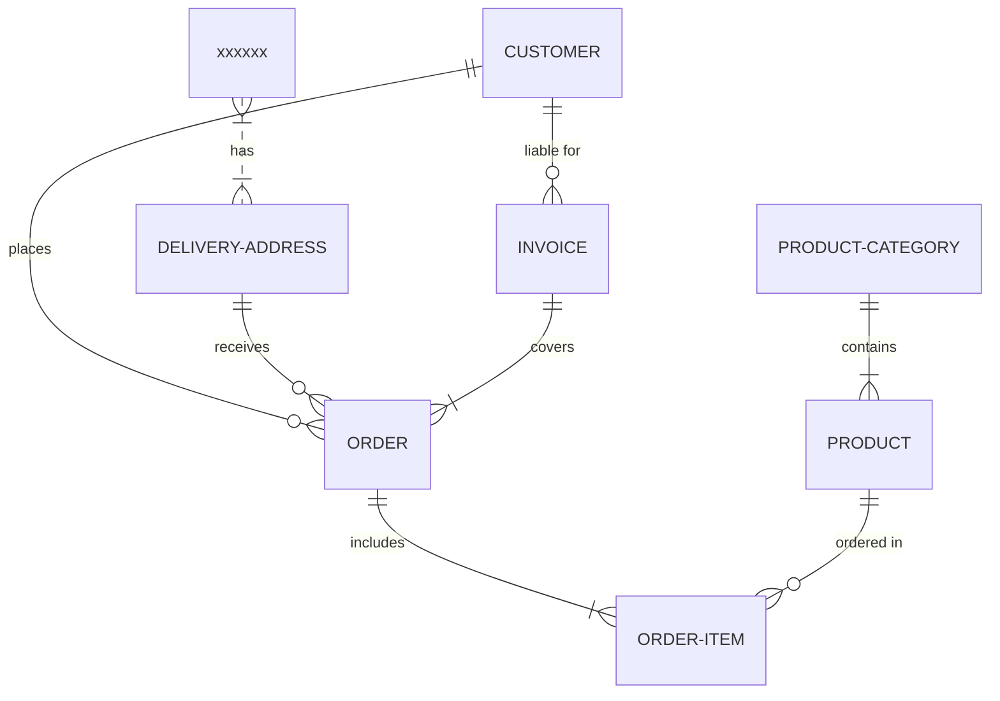

# Car Rent
## First Chapter

[asdf](http:/asdfasdf)

|aasdf | adf |
|---|----|
| asdf | adsf |
| adsf | asdf |

# asdf

```powershell
Get-Service
```

```csharp
public class MyClass
{

}
```

[](http://www.youtube.com/watch?v=YOUTUBE_VIDEO_ID_HERE)

<dl>
  <dt>Definition list</dt>
  <dd>Is something people use sometimes.</dd>

  <dt>Markdown in HTML</dt>
  <dd>Does *not* work **very** well. Use HTML <em>tags</em>.</dd>
</dl>



